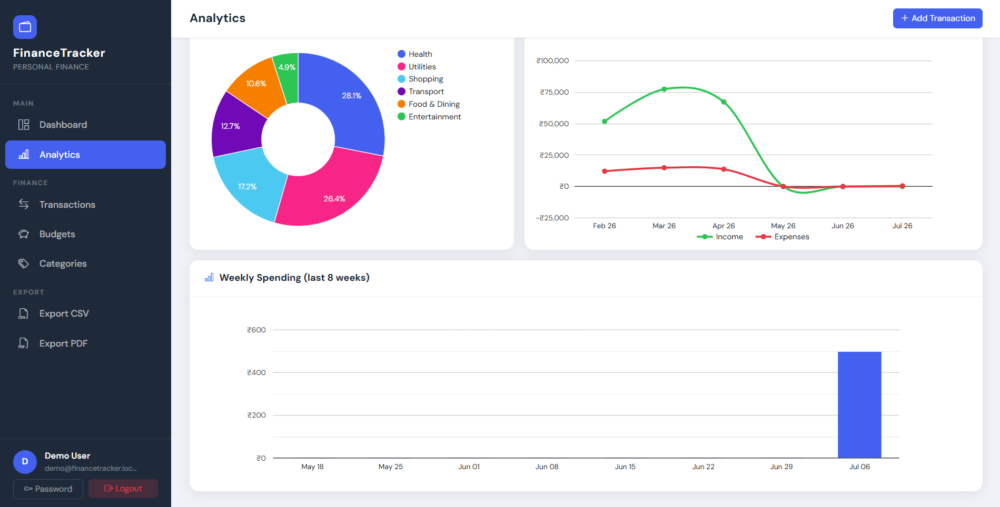
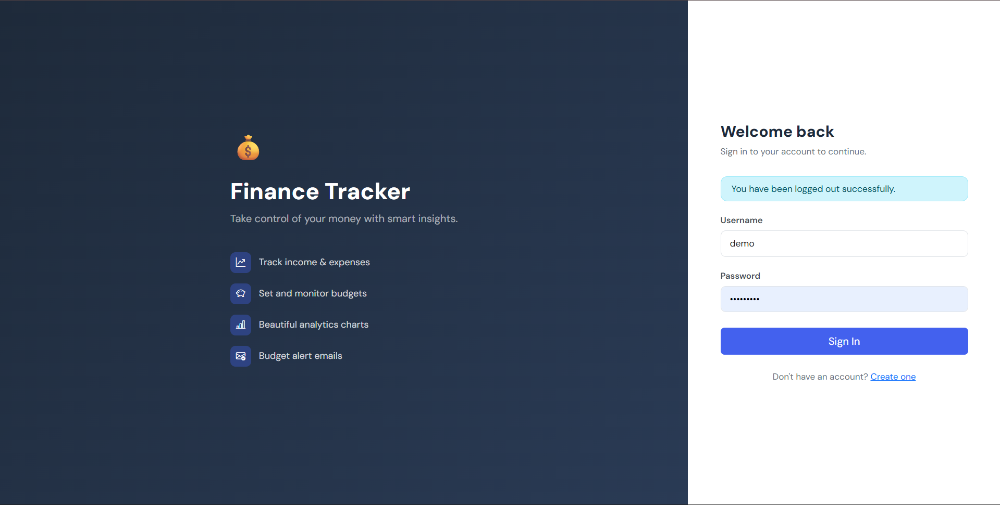
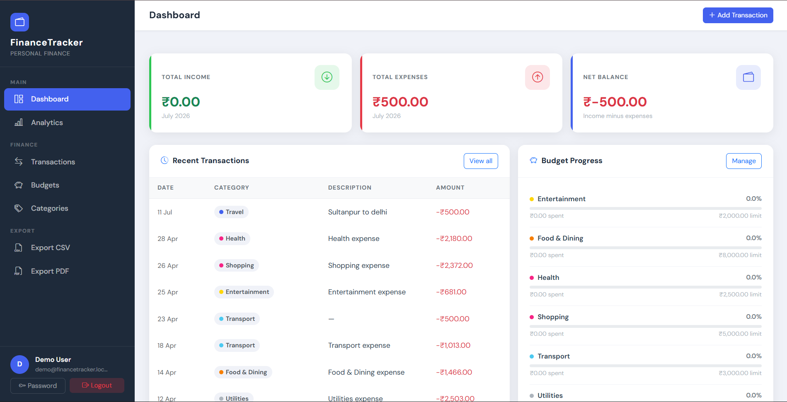

# 💰 Personal Finance Tracker

A production-ready full-stack Django 4.x web application for tracking income, expenses, budgets, and financial analytics.

---

## ✨ Features

| Module | Capabilities |
|---|---|
| **Auth** | Register · Login · Logout · Password change |
| **Transactions** | Add · Edit · Delete · Filter by type/category/date/search · Pagination |
| **Categories** | 15 predefined global categories + unlimited custom categories |
| **Budgets** | Monthly budgets per category · Progress bars · 80%/100% email alerts |
| **Analytics** | Google Charts: Pie (category spend) · Line (monthly trend) · Bar (weekly spend) |
| **Exports** | CSV (all transactions) · PDF (monthly report via ReportLab) |
| **Dashboard** | Income · Expense · Net balance · Budget progress · Recent transactions |

---
## 📸 Screenshots

### Dashboard


### Login Page


### Add value


---

## 🛠 Tech Stack

- **Backend**: Django 4.2, Python 3.11+
- **Database**: SQLite3
- **Frontend**: Bootstrap 5.3, Vanilla JS (ES6+)
- **Charts**: Google Charts API
- **Email**: Django SMTP (console backend for dev)
- **PDF**: ReportLab 4.x
- **CSV**: Python `csv` module

---

## 🚀 Quick Start

### 1. Install dependencies

```bash
pip install -r requirements.txt
```

### 2. Configure environment

```bash
cp .env.example .env
# Open .env and set:
#   SECRET_KEY=<generate with: python -c "from django.core.management.utils import get_random_secret_key; print(get_random_secret_key())">
#   EMAIL_HOST_USER / EMAIL_HOST_PASSWORD  (or leave console backend for dev)
```

### 3. Run migrations

```bash
python manage.py migrate
```

This applies two migrations:
- `0001_initial` — creates all tables with indexes & constraints
- `0002_seed_predefined_categories` — inserts 15 global categories

### 4. (Optional) Load demo data

```bash
python manage.py seed_demo
# Creates user: demo / Demo@1234
# Populates 3 months of sample transactions and budgets
```

### 5. Create your own superuser

```bash
python manage.py createsuperuser
```

### 6. Start the server

```bash
python manage.py runserver
```

Visit: http://127.0.0.1:8000

---

## 🗂 Project Structure

```
finance_tracker/
├── manage.py
├── requirements.txt
├── .env.example
│
├── finance_tracker/          ← Django project package
│   ├── settings.py           ← All configuration (uses python-decouple)
│   ├── urls.py               ← Root URL router
│   ├── wsgi.py / asgi.py
│
├── tracker/                  ← Main Django app
│   ├── models.py             ← Category, Transaction, Budget
│   ├── forms.py              ← All ModelForms + filter form
│   ├── services.py           ← Business logic (summaries, chart data)
│   ├── signals.py            ← post_save → budget alert emails
│   ├── admin.py              ← Rich admin interface
│   ├── apps.py               ← AppConfig (registers signals)
│   ├── templatetags/
│   │   └── finance_tags.py   ← currency, percentage, income_color filters
│   ├── migrations/
│   │   ├── 0001_initial.py
│   │   └── 0002_seed_predefined_categories.py
│   ├── views/
│   │   ├── auth_views.py
│   │   ├── dashboard_views.py
│   │   ├── transaction_views.py
│   │   ├── category_views.py
│   │   ├── budget_views.py
│   │   ├── chart_views.py     ← JSON endpoints for Google Charts
│   │   ├── analytics_views.py
│   │   └── export_views.py    ← CSV + PDF
│   ├── urls/
│   │   ├── auth_urls.py       ← /auth/…
│   │   └── app_urls.py        ← /dashboard/, /transactions/, /api/…
│   └── management/commands/
│       └── seed_demo.py
│
├── templates/
│   ├── base.html              ← Master layout (sidebar + topbar)
│   ├── registration/          ← login, register, password_change
│   └── email/                 ← budget_warning.html, budget_critical.html
│
├── tracker/templates/tracker/
│   ├── dashboard.html
│   ├── analytics.html         ← Google Charts page
│   ├── transactions/          ← list, form, confirm_delete
│   ├── categories/            ← list, form, confirm_delete
│   └── budgets/               ← list, form, confirm_delete
│
└── static/
    ├── css/main.css           ← Custom styles on Bootstrap 5
    └── js/main.js             ← Sidebar, animations, UX helpers
```

---

## 🔗 URL Map

| URL | View | Description |
|---|---|---|
| `/` | Redirect | → `/dashboard/` |
| `/auth/register/` | RegisterView | Create account |
| `/auth/login/` | CustomLoginView | Sign in |
| `/auth/logout/` | CustomLogoutView | Sign out |
| `/dashboard/` | DashboardView | Main overview |
| `/analytics/` | AnalyticsView | Google Charts page |
| `/transactions/` | TransactionListView | Filtered paginated list |
| `/transactions/add/` | TransactionCreateView | Add transaction |
| `/transactions/<pk>/edit/` | TransactionUpdateView | Edit transaction |
| `/transactions/<pk>/delete/` | TransactionDeleteView | Delete transaction |
| `/categories/` | CategoryListView | List all categories |
| `/budgets/` | BudgetListView | Current month budgets |
| `/export/csv/` | ExportCSVView | Download all transactions |
| `/export/pdf/` | ExportPDFView | Download monthly PDF report |
| `/api/charts/category-spending/` | CategorySpendingAPIView | JSON for pie chart |
| `/api/charts/monthly-trend/` | MonthlyTrendAPIView | JSON for line chart |
| `/api/charts/weekly-spending/` | WeeklySpendingAPIView | JSON for bar chart |
| `/admin/` | Django Admin | Admin panel |

---

## ⚙️ Email Configuration

**Development** (default — prints to console):
```env
EMAIL_BACKEND=django.core.mail.backends.console.EmailBackend
```

**Production** (Gmail example):
```env
EMAIL_BACKEND=django.core.mail.backends.smtp.EmailBackend
EMAIL_HOST=smtp.gmail.com
EMAIL_PORT=587
EMAIL_USE_TLS=True
EMAIL_HOST_USER=your-email@gmail.com
EMAIL_HOST_PASSWORD=your-app-password   # Use Gmail App Password, not main password
DEFAULT_FROM_EMAIL=Finance Tracker <your-email@gmail.com>
```

Budget alert emails fire automatically via Django signals when:
- A transaction pushes category spending to **≥ 80%** of the budget → warning email
- A transaction pushes category spending to **≥ 100%** of the budget → critical email

Each alert is sent **once per budget period** (tracked via `warning_sent`/`critical_sent` flags).

---

## 📊 Chart API Reference

All endpoints require login (`@login_required`).

**`GET /api/charts/category-spending/?month=M&year=Y`**
```json
{
  "data": [["Category", "Amount"], ["Food & Dining", 4200.0], ["Transport", 1500.0]],
  "status": "ok"
}
```

**`GET /api/charts/monthly-trend/?months=6`**
```json
{
  "labels": ["Nov 24", "Dec 24", "Jan 25"],
  "income":  [65000.0, 70000.0, 68000.0],
  "expense": [28000.0, 35000.0, 29000.0],
  "status": "ok"
}
```

**`GET /api/charts/weekly-spending/?weeks=8`**
```json
{
  "data": [["Week Starting", "Expenses"], ["Apr 01", 3200.0], ["Apr 08", 4100.0]],
  "status": "ok"
}
```

---

## 🧪 Testing Checklist

After `python manage.py runserver`:

- [ ] Register a new account → redirected to dashboard
- [ ] Login / Logout works
- [ ] Add income transaction → balance increases
- [ ] Add expense transaction → balance decreases
- [ ] Filter transactions by type, category, date range, search
- [ ] Create a budget → progress bar appears on dashboard
- [ ] Add expense that crosses 80% → warning email in console
- [ ] Add expense that crosses 100% → critical email in console
- [ ] Analytics page loads all 3 Google Charts
- [ ] Change month selector on analytics → pie chart refreshes
- [ ] Download CSV → file opens in spreadsheet app
- [ ] Download PDF → clean formatted report with tables
- [ ] Admin panel at `/admin/` — verify all models visible
- [ ] Mobile layout — sidebar collapses, hamburger appears
- [ ] `python manage.py seed_demo` → demo/Demo@1234 works

---

## 🔒 Security Notes

- All views behind `LoginRequiredMixin` or `@login_required`
- CSRF protection on all POST forms (``)
- Users can only access their own data (queryset filtered by `user=request.user`)
- `PermissionDenied` raised if user tries to edit/delete another user's data
- Predefined categories are read-only (protected in view layer)
- Passwords hashed with Django's default PBKDF2+SHA256

---

## 📄 License

MIT — free to use, modify, and distribute.


---

# 🤝 Collaborative Project

This project was developed as a collaborative effort by multiple contributors. Each team member contributed to different aspects of the application, including backend development, frontend development, database design, testing, deployment, and documentation.

## 👑 Maintained by

**Project Owner:** **Mr. Jitendra Kumar Barik** (https://github.com/py-007)

- Feature-based development
- Git branches for each contributor
- Pull Requests for code review
- GitHub Issues for task tracking
- Collaborative testing before merging

## 🤝 Contributors
**Suyash Singh** (https://github.com/suyXcode)

- Designed responsive UI
- Implemented dashboard
- Testing
- Deployment


